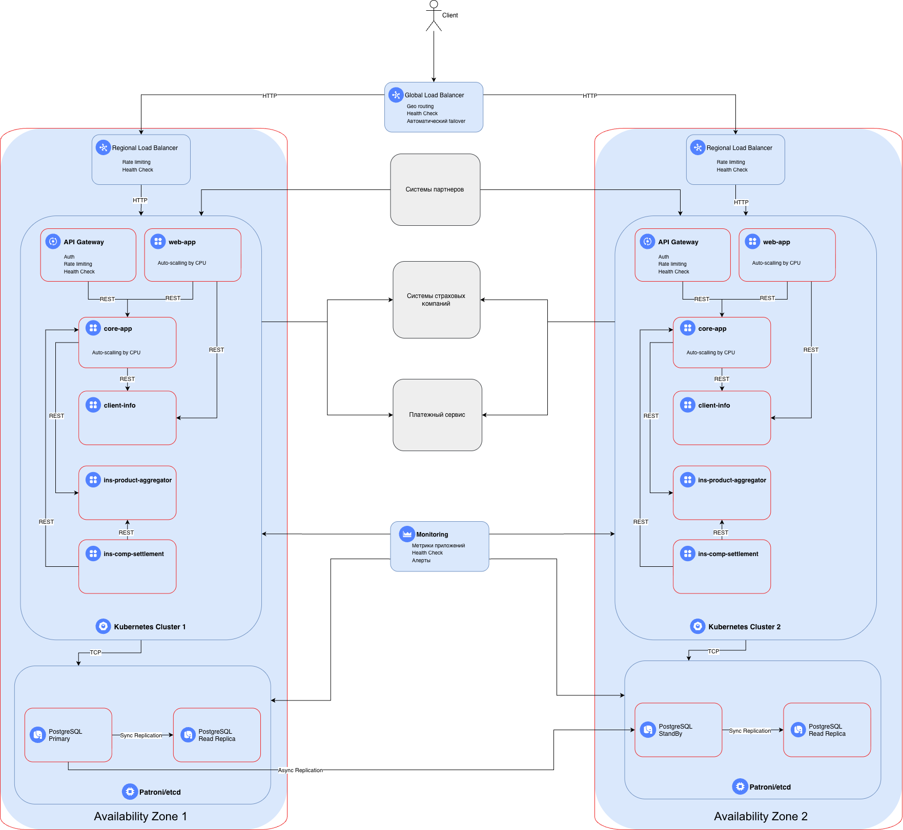

# Task1

## 1. Стратегия масштабирования и отказоустойчивости

### 1.1 Горизонтальное масштабирование

**Обоснование:**

Микросервисная архитектура на Kubernetes идеально подходит для горизонтального масштабирования, обеспечивая возможность независимого масштабирования каждого сервиса. Такой подход позволяет более экономично использовать ресурсы и обеспечивает лучшую отказоустойчивость, что упростит достижение требуемой доступности в 99.9%.

**Вертикальное масштабирование** используется как дополнительная мера:

- Увеличение ресурсов БД при необходимости
- Временное увеличение мощности подов при пиковых нагрузках

### 1.2 Зоны безопасности и доступности

**Решение: Использование нескольких зон**

**Структура:**

1. **Регион 1 (Москва)** - основной. Обслуживает 70% трафика (европейская часть РФ)

2. **Регион 2 (Новосибирск)** - DR Site + Active. Обслуживает 30% трафика (азиатская часть РФ)

**Преимущества:**

- Снижение latency для пользователей из разных регионов
- Соответствие требованиям RTO (45 мин) и RPO (15 мин)
- Защита от региональных сбоев
- Возможность обслуживания при недоступности одного региона

## 2. Конфигурация Kubernetes

### 2.1 Независимые кластеры

**Решение: Два независимых Kubernetes кластера (по одному в каждом регионе)**

**Обоснование:**

1. **Отказоустойчивость** - сбой в одном кластере не влияет на другой
2. **RTO/RPO соответствие** - быстрое восстановление без зависимостей
3. **Низкая латентность** - каждый кластер обслуживает свой регион локально
4. **Простота управления** - нет сложной синхронизации состояния между регионами
5. **Масштаб воздействия** - ограничение зоны влияния инцидентов
6. **Сетевая изоляция** - меньше рисков сетевых проблем

## 3. Балансировка нагрузки

### 3.1 Многоуровневая балансировка

#### Уровень 1: Global Load Balancer

- **Решение**: Yandex Application Load Balancer
- **Функции**:
  - Geo-routing - направление клиентов в ближайший регион
  - Health check
  - Автоматический failover за 30 секунд
  - Приоритеты по регионам: Регион 1 - 70%, Регион 2 - 30%

#### Уровень 2: Regional Load Balancer

- **Решение**: Application Load Balancer в каждом регионе
- **Функции**:
  - SSL-терминация
  - WAF (Web Application Firewall)
  - Rate limiting
  - Health check
  - Распределение трафика между подами

#### Уровень 3: Kubernetes Service + Ingress

- **Решение**: Nginx Ingress Controller или Istio
- **Функции**:
  - Service mesh
  - Health check
  - Circuit breaker
  - Retry logic

## 4. Failover стратегия

### 4.1 Active-Active конфигурация

**Режим работы**: Оба региона активны одновременно

**Распределение трафика:**

- Регион 1 - 70% трафика. Клиенты из европейской части РФ
- Регион 2 - 30% трафика. Клиенты из азиатской части РФ

### 4.2 Сценарии отказа

#### Сценарий 1: Отказ отдельного пода

Kubernetes непрерывно отслеживает состояние подов через Liveness и Readiness пробы. В случае отказа отдельного инстанса, система обнаруживает сбой в течение 3 секунд и автоматически исключает проблемный под из балансировки нагрузки, направляя запросы на здоровые экземпляры. RTO составляет менее 10 секунд, при этом для пользователей процесс происходит прозрачно и без ощутимого влияния на сервис.

#### Сценарий 2: Отказ зоны доступности

Мониторинг доступности зон осуществляется через Regional Load Balancer с интервалом проверок health check в 5 секунд. При недоступности одной из зон, балансировщик автоматически перенаправляет весь трафик на резервную зону доступности в том же регионе. Восстановление обслуживания занимает менее 30 секунд. Влияние на пользователей минимально, возможны единичные ошибки в момент переключения трафика.

#### Сценарий 3: Отказ целого региона

Global Load Balancer проверяет доступность регионов каждые 10 секунд. При обнаружении полного отказа региона, балаесировщик прекращает маршрутизацию запросов в него и перенаправляет 100% трафика в работоспособный регион. Параллельно инициируется автоматическое масштабирование подов в живом регионе для обработки возросшей нагрузки, а дежурная смена получает оповещение через систему мониторинга и алертинга. RTO не превышает 2 минут. Часть пользователей может наблюдать повышенные задержки из-за географической удаленности резервного региона.

#### Сценарий 4: Отказ Primary БД

Кластер Patroni отслеживает состояние Primary узла базы данных с периодом обнаружения сбоя в 5 секунд. В случае отказа автоматически инициируется процедура failover: одна из синхронных реплик повышается до роли Primary, после чего обновляется конфигурация приложений через Service Discovery для переключения на новый мастер. Полный цикл восстановления (RTO), включая проверки консистентности, занимает 30-40 минут, при этом RPO равен нулю благодаря синхронной репликации внутри региона.

## 5. Конфигурация базы данных

### 5.1 Архитектура БД: Patroni + etcd

Для обеспечения высокой доступности базы данных мы используем кластер PostgreSQL под управлением Patroni. Это решение стало стандартом индустрии и позволяет автоматизировать failover, управление конфигурацией и репликацией. В качестве распределенного хранилища конфигурации и координации узлов применяется etcd. Для эффективного управления подключениями приложений к БД используется связка HAProxy и PgBouncer, что позволяет сглаживать пиковые нагрузки и переиспользовать соединения.

### 5.2 Репликация

Стратегия репликации построена на двухуровневой схеме. Внутри основного региона настроена **синхронная потоковая репликация**. Это критически важно для обеспечения RPO = 0: транзакция считается успешной только после подтверждения записи минимум одной репликой. Платой за гарантию сохранности данных является небольшое (около 10-15%) снижение производительности на запись, что для наших объемов приемлемо.

Для защиты от региональных катастроф организована **асинхронная репликация** между основным (Москва) и резервным (Новосибирск) регионами. Standby-кластер во втором регионе может использоваться для обслуживания аналитических read-only запросов, снижая нагрузку на основной мастер. При полном отказе основного региона возможна потеря данных до 15 минут (асинхронный лаг), что соответствует нашему SLA.

### 5.3 Backup стратегия

Резервное копирование реализовано по схеме Continuous Archiving. WAL-файлы отправляются в S3-совместимое хранилище каждые 5 минут. Полный бэкап (Full backup) снимается раз в сутки, а инкрементальный — каждый час. Глубина хранения архивов составляет 30 дней, что позволяет нам выполнять Point-in-Time Recovery (PITR) на любую секунду в рамках этого окна.

Для надежности настроена cross-region репликация бакета с бэкапами. Даже если весь основной регион, включая локальное S3-хранилище, будет уничтожен, мы сможем восстановиться из копии в другом регионе.

### 5.4 Обоснование отказа от шардирования

На текущем этапе развития проекта мы приняли осознанное решение **не внедрять шардирование**. Текущий объем данных (50 GB) и прогнозируемый рост позволяют комфортно работать в рамках одного инстанса PostgreSQL, который отлично справляется с объемами до нескольких терабайт.

Внедрение шардирования сейчас принесло бы неоправданную сложность: проблемы с кросс-шардовыми транзакциями, усложнение логики приложения и join-запросов. Вместо этого мы используем вертикальное масштабирование и read-реплики. Запас производительности связки Patroni + PgBouncer с большим запасом покрывает текущие требования в 50 RPS на поиск и 10 RPS на оформление полисов.
