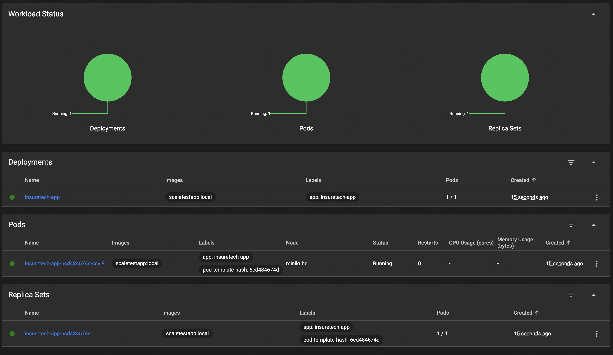
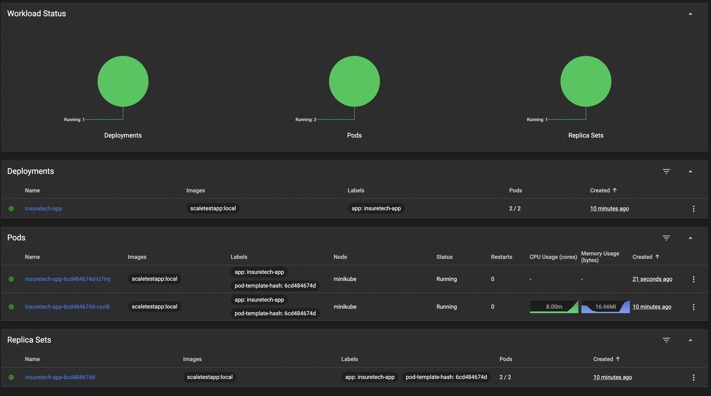
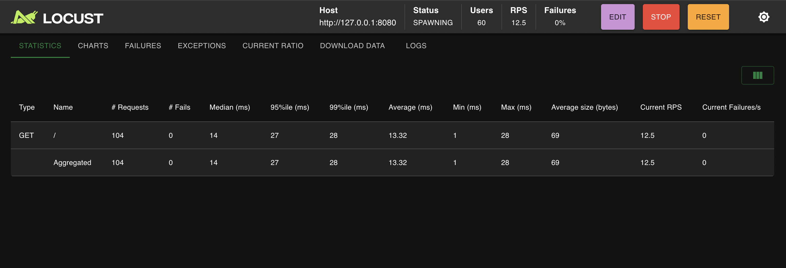

# Task 2

## Системные требования

- Minikube
- kubectl
- Python 3.x
- locust

## Поднятие окружения

```bash
cd task2

# 1. Запуск кластера
minikube start
minikube addons enable metrics-server

# 2. Сборка scaletestapp
./build-scaletestapp.sh

# 3. Применение манифестов
kubectl apply -f deployment.yaml
kubectl apply -f service.yaml
kubectl apply -f hpa.yaml

# 4. Запуск мониторинга
./monitor-scaling.sh

# 5. Доступ к сервису
kubectl port-forward deployment/insuretech-app 8080:8080

# 6. Нагрузочное тестирование
python3 -m venv .venv
source .venv/bin/activate
pip install locust
locust -f locustfile.py --host=http://127.0.0.1:8080
# Открыть http://localhost:8089, запустить с 300-500 пользователями
```

## Результаты

### Minikube dasboard

#### до нагрузки



#### после нагрузки



### Locust



### Логи мониторинга подов

[Logs](scaling-monitor.log.txt)
