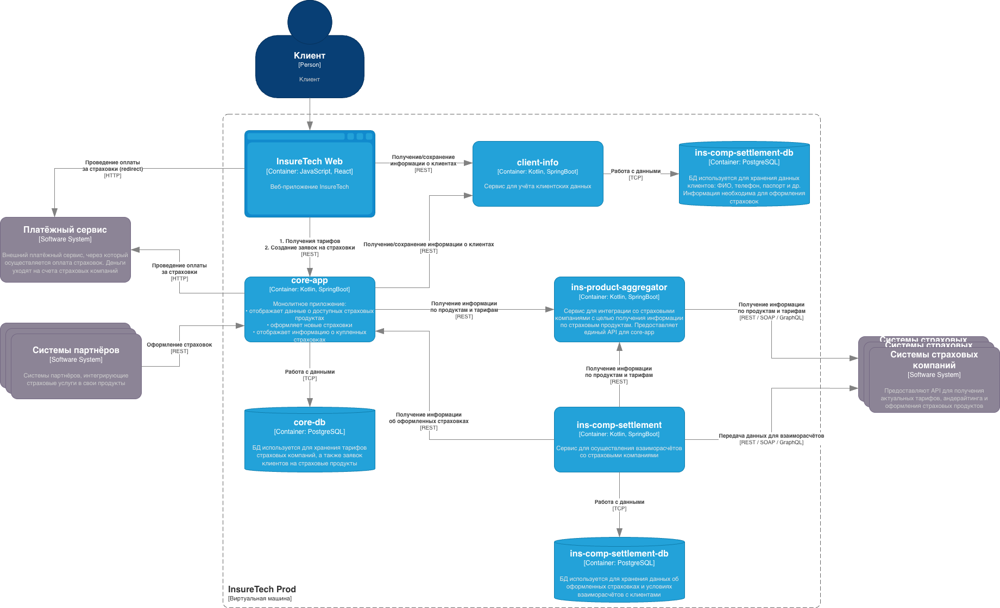
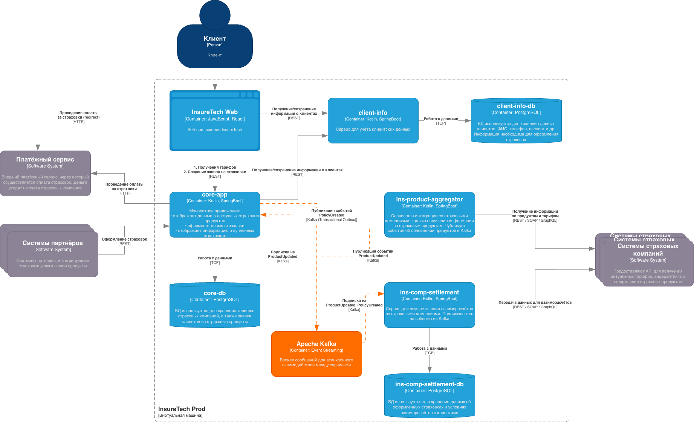

# Task 3

## Проблемы текущей архитектуры

#### Диаграмма (before)



При росте с 5 до 10 страховых компаний возможны следующие проблемы:

**ins-product-aggregator** - так как синхронно опрашивает внешние API, то при 10 интеграциях вероятность тормозов увеличивается. Нет Circuit Breaker - один упавший провайдер свалит весь сервис

**polling** - `core-app` обновляет тарифы раз в 15 минут, `ins-comp-settlement` - раз в сутки. Пользователи видят устаревшие данные, а расчёты могут идти по старым тарифам

**Передача продаж** - `ins-comp-settlement` забирает все страховки за сутки одним REST-запросом. При росте объёмов могут возникнуть таймауты, OOM и нагрузка на БД в пике

**Связанность** - всё синхронно зависит друг от друга. Нет буферизации, нет replay

## Event-Driven Architecture (на основе Kafka)

#### Диаграмма (after)



### Получение продуктов

Было:

```
core-app --[REST]--> ins-product-aggregator --[REST/SOAP]--> СК --> обратно
```

Стало:

```
СК --[webhook/poll]--> ins-product-aggregator --> [Kafka: products.updated] --> core-app, ins-comp-settlement
```

Отказ одной СК не влияет на остальных. Данные приходят сразу, а не через 15 минут.

### Потоковая передача продаж

Было: ночной batch-запрос всех полисов за сутки.

Стало: при оформлении полиса событие сразу уходит в Kafka.

```
core-app --> [Transaction: policy + outbox] --> [Debezium/Poller] --> [Kafka: policies.created] --> ins-comp-settlement
```

Нагрузка размазана, нет тяжёлых запросов, данные в real-time.

### Transactional Outbox

Для `core-app` критично если транзакция БД прошла, а Kafka упадет и запись о продаже потеряется для взаиморасчётов.

Решение: в одной транзакции пишем полис и событие в таблицу `outbox`. Отдельный процесс отправляет в Kafka.

Пример таблицы:

```sql
CREATE TABLE outbox (
    id UUID PRIMARY KEY,
    aggregate_type VARCHAR(255),
    aggregate_id VARCHAR(255),
    event_type VARCHAR(255),
    payload JSONB,
    created_at TIMESTAMP,
    processed_at TIMESTAMP
);
```

### Топики

| Топик              | Producer               | Consumer                      |
| ------------------ | ---------------------- | ----------------------------- |
| `products.updated` | ins-product-aggregator | core-app, ins-comp-settlement |
| `policies.created` | core-app               | ins-comp-settlement           |
