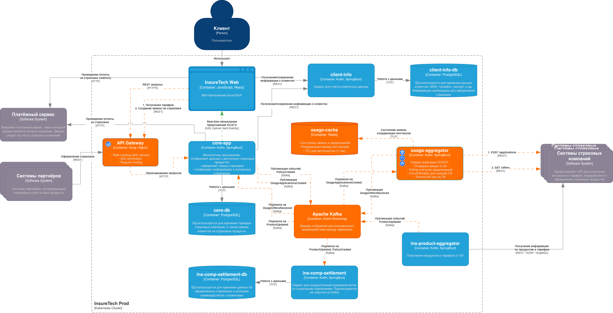

# Task 4

## Диаграмма

## Пользовательский сценарий

1. Клиент заполняет заявку на ОСАГО в веб-приложении
2. Заявка через API Gateway попадает в core-app, сохраняется и публикуется в Kafka
3. osago-aggregator получает событие и параллельно отправляет заявки во все СК
4. По мере получения предложений - публикует их обратно в Kafka
5. core-app пушит предложения клиенту через SSE в реальном времени

## osago-aggregator

Сервис агрегации предложений ОСАГО, работает только через Kafka

**Redis** - для хранения состояния заявок и координации polling между инстансами, а также для блокировок (distributed locks).

**Логика работы:**

- Получает событие `OsagoApplicationsCreated`
- Отправляет запросы на создание приложений во все системы страховых компаний
- Поллит каждые 2-3 сек до получения offer (с таймаутом 60 сек)
- При получении предложения публикует `OsagoOffersReceived`

## Паттерны отказоустойчивости

**Rate Limiting** - используется в API Gateway
**Circuit Breaker** - используется в osago-aggregator для изоляции отказов (падение одной системы страховой компаний не влияет на остальные)
**Timeout** - используется в osago-aggregator в запросах к системе страховой компаний
**Retry** - используется в osago-aggregator в запросах к системе страховой компаний с экспоненциальным бэкофом при поллинге
