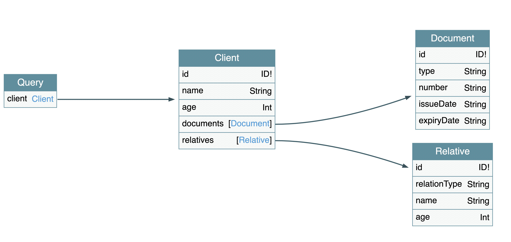

# Task5

### Client

Сущность клиента. Объединяет атрибуты клиента и связанные с ним данные (документы, родственники), что позволяет получать необходимые срезы данных в одном запросе.

`relatives`
Информация о родственниках клиента.
Ранее отдельный ресурс: `GET /clients/{id}/relatives`

`documents`
Список документов клиента.
Ранее отдельный ресурс: `GET /clients/{id}/documents`

### Document

Документ, удостоверяющий личность или иные документы клиента

### Relative

Информация о родственнике клиента
